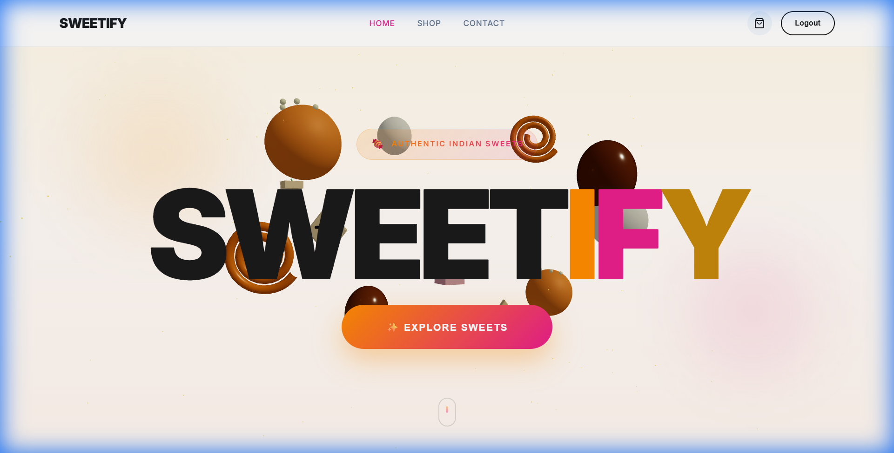
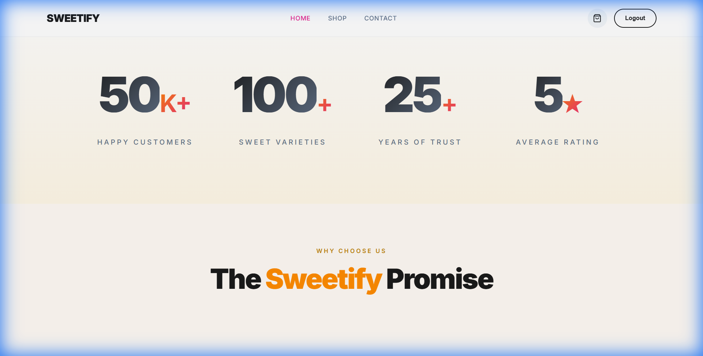
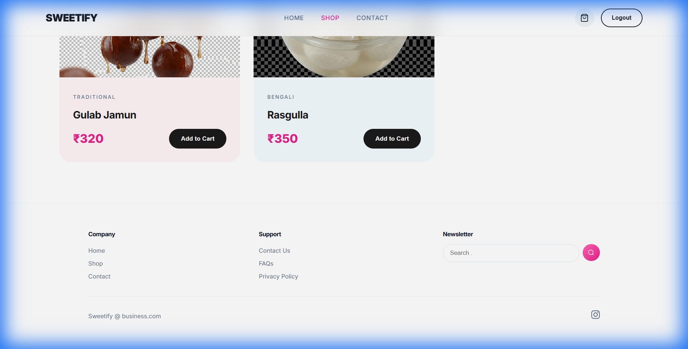

# 🍬 Sweetify - Indian Sweets E-commerce Platform

A modern, full-stack e-commerce platform for traditional Indian sweets, featuring stunning 3D animations, responsive design, and a seamless shopping experience.



## 🌟 Features

### Frontend
- **3D Floating Sweets Animation** - Interactive Three.js-powered 3D models of Indian sweets (Laddu, Gulab Jamun, Jalebi, Rasgulla, Kaju Katli, Barfi)
- **Smooth Animations** - GSAP-powered scroll animations and micro-interactions
- **Modern UI/UX** - Premium design with warm Indian sweet theme
- **Responsive Design** - Works seamlessly on desktop and mobile
- **Shopping Cart** - Add/remove items, quantity management
- **User Authentication** - Register, login, and secure sessions
- **Product Catalog** - Browse sweets with images, descriptions, and prices in ₹

### Backend
- **RESTful API** - Express.js with TypeScript
- **Authentication** - JWT-based secure authentication
- **Database** - Prisma ORM with SQLite
- **Inventory Management** - Stock tracking and management
- **Admin Dashboard** - Product management interface

## 📸 Screenshots

### Home Page - Hero Section


### Features Section


### Shop - Indian Sweets with ₹ Prices


## 🛠️ Tech Stack

### Frontend
- **React 19** - UI Framework
- **Vite** - Build Tool
- **TypeScript** - Type Safety
- **Three.js** - 3D Graphics (@react-three/fiber, @react-three/drei)
- **GSAP** - Animations
- **Framer Motion** - UI Animations
- **React Router** - Client-side Routing
- **Axios** - HTTP Client
- **Lenis** - Smooth Scrolling

### Backend
- **Node.js** - Runtime
- **Express.js** - Web Framework
- **TypeScript** - Type Safety
- **Prisma** - ORM
- **SQLite** - Database
- **JWT** - Authentication
- **Jest** - Testing
- **Zod** - Validation

## 🚀 Getting Started

### Prerequisites
- Node.js v18 or higher
- npm v9 or higher

### Installation

#### 1. Clone the Repository
```bash
git clone https://github.com/berserk3142-max/Meethaiwala-.git
cd Meethaiwala-
```

#### 2. Backend Setup
```bash
# Navigate to backend directory
cd backend

# Install dependencies
npm install

# Set up environment variables
cp .env.example .env
# Edit .env with your configuration

# Generate Prisma client and run migrations
npx prisma generate
npx prisma db push

# Start development server
npm run dev
```

The backend will start at `http://localhost:3001`

#### 3. Frontend Setup
```bash
# Open a new terminal, navigate to frontend directory
cd frontend

# Install dependencies
npm install

# Start development server
npm run dev
```

The frontend will start at `http://localhost:5173`

### Environment Variables

#### Backend (.env)
```env
DATABASE_URL="file:./dev.db"
JWT_SECRET="your-super-secret-key"
JWT_EXPIRES_IN="7d"
PORT=3001
```

## 📁 Project Structure

```
Meethaiwala-/
├── backend/
│   ├── src/
│   │   ├── middleware/     # Auth middleware
│   │   ├── routes/         # API routes
│   │   ├── services/       # Business logic
│   │   ├── utils/          # Utilities
│   │   └── types/          # TypeScript types
│   ├── tests/              # Jest test files
│   ├── prisma/             # Database schema
│   └── package.json
│
├── frontend/
│   ├── src/
│   │   ├── components/     # Reusable components
│   │   │   ├── FloatingSweets3D.tsx  # 3D animations
│   │   │   ├── Navbar.tsx
│   │   │   └── Footer.tsx
│   │   ├── pages/          # Page components
│   │   │   ├── Home.tsx
│   │   │   ├── Shop.tsx
│   │   │   ├── Cart.tsx
│   │   │   └── ProductDetail.tsx
│   │   ├── context/        # React Context
│   │   ├── services/       # API calls
│   │   └── hooks/          # Custom hooks
│   ├── public/             # Static assets (sweet images)
│   └── package.json
│
├── docs/
│   └── screenshots/        # Application screenshots
│
└── README.md
```

## 🧪 Running Tests

### Backend Tests
```bash
cd backend
npm test
```

### Test Coverage
```bash
cd backend
npm run test:coverage
```

## 📊 Test Report

The backend includes comprehensive test suites for:
- **Authentication Tests** (`auth.test.ts`) - User registration, login, token validation
- **Sweets API Tests** (`sweets.test.ts`) - CRUD operations for sweets
- **Inventory Tests** (`inventory.test.ts`) - Stock management, purchase, restock

Run `npm test` in the backend directory to execute all tests.

## 🛒 API Endpoints

### Authentication
| Method | Endpoint | Description |
|--------|----------|-------------|
| POST | `/api/auth/register` | Register new user |
| POST | `/api/auth/login` | User login |

### Sweets
| Method | Endpoint | Description |
|--------|----------|-------------|
| GET | `/api/sweets` | Get all sweets |
| GET | `/api/sweets/:id` | Get sweet by ID |
| POST | `/api/sweets` | Create sweet (Admin) |
| PUT | `/api/sweets/:id` | Update sweet (Admin) |
| DELETE | `/api/sweets/:id` | Delete sweet (Admin) |
| POST | `/api/sweets/:id/purchase` | Purchase sweet |
| POST | `/api/sweets/:id/restock` | Restock sweet (Admin) |

## 🎨 Indian Sweets Catalog

| Sweet | Price | Description |
|-------|-------|-------------|
| Gujiya | ₹450 | Crispy fried pastry filled with sweet khoya & dry fruits |
| Premium Barfi Mix | ₹650 | Assorted barfi with silver vark & pistachios |
| Fresh Jalebi | ₹280 | Crispy golden spirals soaked in sugar syrup |
| Laddu Collection | ₹520 | Assorted laddus - Besan, Motichoor, Coconut & more |
| Balushahi | ₹380 | Flaky sweet delicacy dipped in sugar syrup |
| Kaju Katli | ₹850 | Diamond-shaped cashew fudge with silver foil |
| Gulab Jamun | ₹320 | Soft milk dumplings in rose-flavored syrup |
| Rasgulla | ₹350 | Spongy cottage cheese balls in light syrup |

## 🌐 Deployment

### Vercel (Frontend)
1. Import repository from GitHub
2. Set root directory to `frontend`
3. Deploy

### Backend
The backend can be deployed to Railway, Render, or similar platforms.

## 👨‍💻 Author

Built with ❤️ for the love of Indian sweets

## 📄 License

This project is open source and available under the [MIT License](LICENSE).
